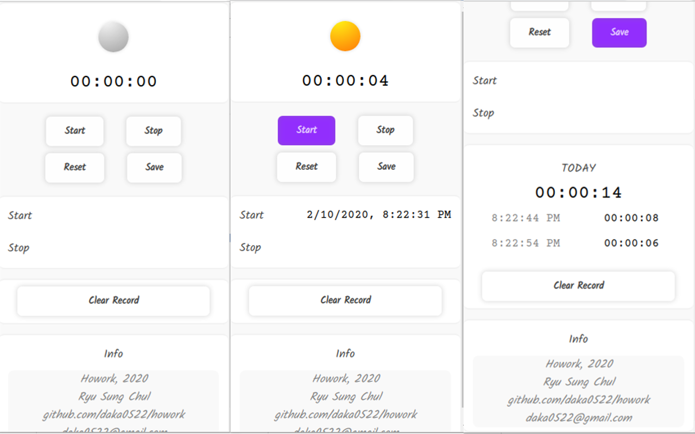

# howork
Purpose: Check & log the time you really work
Process: 
  1. Start the stop watch
  2. Stop it
  3. Save it
  4. Record & look at the total time in the day
  
## Demo version, not published in webstore yet!

Chrome extension to check and log the times how many you really work (like stopwatch).

This app is to know how exactly know I work in a day and in days.

Simple start stopwatch and stop, reset or save.

And get the records.

